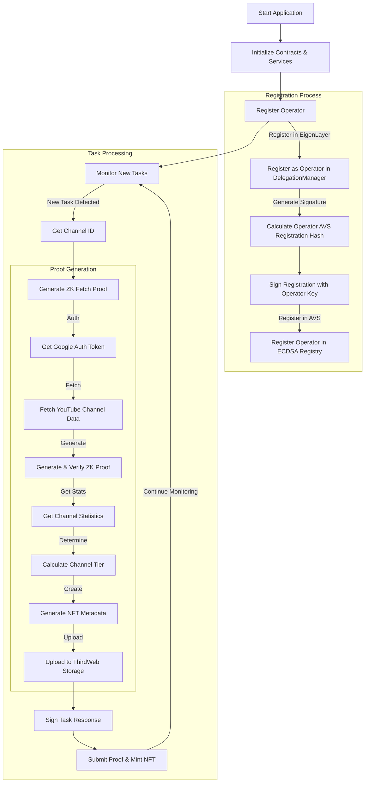

<h1 align="center">CreatorHub-AVS 👋</h1>
<p>
  
  <a href="#" target="_blank">
    
  </a>
</p>

CreatorHub AVS provides a streamlined solution for managing and automating tasks in the creator ecosystem.
This project utilizes Solidity, JavaScript, and other technologies to create a comprehensive toolkit for creators.
This application integrates with EigenLayer's Actively Validated Service using zk-fetch technology to securely mint non-fungible tokens (NFTs) as ownership proofs for YouTube channel creators. The app monitors new tasks, verifies them through zk-proofs, and mints NFTs based on the creator's subscriber tier.


## Overview

CreatorHub implements an Actively Validated Service (AVS) on EigenLayer to provide decentralized creator monetization services by:
1. Leveraging restaked ETH as security for creator verification and content authenticity
2. Operating distributed nodes that validate creator metrics and engagement
3. Implementing middleware services that bridge YouTube data to on-chain states
4. Providing economic incentives for validators through fee sharing and rewards
5. Enabling on-chain monetization opportunities

### EigenLayer Integration
- Integration with EigenLayer's restaking mechanism
- Delegation of restaked ETH as security backing
- Slashing conditions for validator misbehavior
- Registration and management of AVS operators

### AVS Node Operation
- Distributed network of validator nodes
- Consensus mechanism for YouTube metric validation
- Task delegation and proof generation
- Performance monitoring and reporting

## Architecture



## Features

- YouTube channel ownership verification using zero-knowledge proofs
- Automatic NFT minting based on channel statistics
- Integration with EigenLayer for decentralized operation
- Tier-based NFT metadata generation
- Secure proof validation and submission

## The node will:
- Register as an operator in EigenLayer
- Monitor for new validation tasks
- Process YouTube channel verifications
- Mint NFTs for verified channels

## Contract Deployments

The application expects contract deployment files in the following structure:

```
holesky 
```
```
contracts/
├── deployments/
│   ├── creator-hub/
│   │   └── 17000.json
│   └── core/
│       └── 17000.json
```

## NFT Tiers

The system assigns NFT tiers based on subscriber count:
- Platinum: 10M+ subscribers
- Gold: 1M+ subscribers
- Silver: 10K+ subscribers
- Rookie: 0-10K subscribers

## Install

```sh
yarn
```

## Usage

```sh
yarn start:anvil
```

## Run tests

```sh
# Setup .env file
cp .env.example .env
cp contracts/.env.example contracts/.env

# Updates dependencies if necessary and builds the contracts 
yarn build

# Deploy the EigenLayer contracts
yarn deploy:core

# Deploy the Hello World AVS contracts
yarn deploy:creator

# (Optional) Update ABIs
yarn extract:abis

# Start the Operator application
yarn start:operator

```

```sh
# Start the createNewTasks application 
yarn start:traffic
```


### Future Improvements

* **Enhanced Video Processing**

#Advanced Content Fingerprinting


This is a technology that creates unique digital signatures for video content
Helps identify and track videos across platforms
Makes it easier to detect duplicates and unauthorized copies
Can track even slightly modified versions of the original content


#### Automated Copyright Detection


Automatically scans videos to identify copyrighted material
Compares content against databases of registered copyrighted works
Helps prevent copyright infringement before it occurs
Can flag potential violations for human review


#### Dynamic Metadata Updates


Allows real-time updates to video information and attributes
Metadata can include tags, descriptions, categories, and other relevant information
Makes content more searchable and manageable
Enables automatic content organization and classification


#### Multi-format Support


Ability to handle various video formats and codecs
Ensures compatibility across different devices and platforms
Includes support for emerging video technologies
Enables seamless conversion between formats


#### Advanced Operator Management


Improved tools for system administrators and content managers
Better control over content moderation and distribution
Enhanced monitoring and reporting capabilities
Streamlined workflow management


#### Improved Consensus System


Better mechanisms for reaching agreement in decentralized networks
More efficient decision-making processes
Enhanced reliability in distributed systems
Reduced conflicts and faster resolution

* **Security Enhancements**

#### Advanced Fraud Proof Generation


Creates verifiable proofs to detect and prevent fraudulent activities
Automated system for identifying suspicious patterns
Helps maintain system integrity
Provides evidence for enforcement actions

#### Automated Slashing Mechanism


Automatically penalizes bad actors or rule violators
Reduces the need for manual intervention
Helps maintain network security
Deters malicious behavior through economic penalties


#### Enhanced Reward Distribution


More efficient system for distributing incentives
Fair and transparent reward allocation
Automated payment processing
Better tracking of contributions and corresponding rewards


## Show your support

Give a ⭐️ if this project helped you!


## Prerequisites

- **Node.js** v16 or above
- An **Ethereum-compatible network** for contract interactions
- A `.env` file with appropriate configuration values

### Environment Variables

| Variable               | Description                                              |
| ---------------------- | -------------------------------------------------------- |
| `RPC_URL`              | JSON-RPC provider URL                                    |
| `PRIVATE_KEY`          | Private key for the wallet                               |
| `APP_ID`               | Reclaim API application ID                               |
| `APP_SECRET`           | Reclaim API secret key                                   |
| `THIRDWEB_API_KEY`     | API key for the Thirdweb storage provider                |
| `PUBLIC_IMAGE_NFT`     | Public URL for the NFT images                            |


